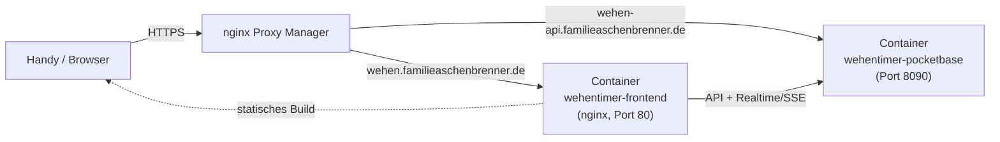

# INITIAL_DEPLOYMENT.md — Erst-Deployment auf dem ugreen-NAS

> Diese Anleitung ist für die **einmalige Ersteinrichtung**. Sie setzt voraus,
> dass auf dem ugreen-NAS bereits **Docker** (Container Manager/Container
> Station o. ä.) und ein laufender **nginx Proxy Manager** (NPM) vorhanden
> sind, und dass du Zugriff auf die DNS-Verwaltung der Domain
> `familieaschenbrenner.de` hast. Für spätere Updates reicht danach ein
> einfacheres Vorgehen (siehe Abschnitt 8).

## 0. Kurzüberblick



Zwei Container, zwei Subdomains, kein Login. Beide Container hängen im
selben Docker-Netzwerk wie der nginx Proxy Manager — dadurch müssen **keine
Ports auf dem NAS-Host veröffentlicht werden** und es kann zu keinem
Portkonflikt mit anderen Projekten (z. B. `otherApp`) kommen.

## 1. DNS einrichten

Zwei Subdomains unter `familieaschenbrenner.de` anlegen und auf die
öffentliche IP/DynDNS-Adresse des NAS zeigen lassen (A-Record oder, falls die
Domain bereits einen DynDNS-Mechanismus für andere Subdomains nutzt, dort
ergänzen):

- `wehen.familieaschenbrenner.de`
- `wehen-api.familieaschenbrenner.de`

Prüfen, ob die DNS-Verwaltung dieser Domain CNAMEs auf eine bestehende
DynDNS-Adresse erlaubt (einfacher) oder ob feste A-Records nötig sind. Nach
dem Anlegen mit `nslookup wehen.familieaschenbrenner.de 8.8.8.8` prüfen, ob
die Auflösung bereits nach außen funktioniert (kann etwas dauern, siehe TTL).

## 2. Projektdateien auf das NAS bringen

Den Projektordner (ohne `node_modules/`, `dist/`) auf das NAS kopieren, z. B.
per SFTP/File-Manager der NAS-Oberfläche oder — falls das Projekt in einem
Git-Repository liegt — per `git clone` direkt auf dem NAS. Zielort z. B.:

```
/volume1/docker/wehentimer/   (Pfad je nach ugreen-NAS-Oberfläche anpassen)
```

Wichtig sind mindestens: `Dockerfile`, `nginx.conf`, `docker-compose.yml`,
`package.json` + `package-lock.json`, `src/`, `public/`, `index.html`,
`vite.config.ts`, alle `tsconfig*.json`, `pwa-assets.config.ts`,
`components.json`, `pocketbase/` (inkl. `pb_migrations/`).

## 3. `.env` auf dem NAS anlegen

Im Projektordner auf dem NAS eine **neue** Datei `.env` anlegen (diese Datei
ist gitignored — nicht die lokale Entwickler-`.env` hierher kopieren, die
enthält die lokale Dev-URL):

```dotenv
VITE_POCKETBASE_URL=https://wehen-api.familieaschenbrenner.de
PROXY_NETWORK_NAME=<siehe Schritt 4>
```

## 4. Docker-Netzwerk des nginx Proxy Managers ermitteln

Damit die neuen Container ohne Host-Ports vom NPM erreichbar sind, müssen sie
im selben Docker-Netzwerk laufen wie der NPM-Container. Netzwerk ermitteln
(per SSH auf dem NAS oder über die Docker-Oberfläche):

```bash
docker network ls
docker inspect <name-des-npm-containers> --format '{{json .NetworkSettings.Networks}}'
```

Den gefundenen Netzwerknamen (z. B. `nginx-proxy-manager_default` oder
`npm_default`) in die `.env` als `PROXY_NETWORK_NAME` eintragen.

**Falls kein gemeinsames Netzwerk möglich ist** (z. B. weil die
NAS-Oberfläche das nicht zulässt): In `docker-compose.yml` bei beiden
Services den `networks:`-Block durch die auskommentierten `ports:`-Zeilen
ersetzen (`8082:80` fürs Frontend, `8092:8090` für PocketBase — bewusst
unübliche Ports, siehe PROJECT_BRIEF.md Abschnitt 6) und in den Proxy Hosts
(Schritt 6) stattdessen die NAS-LAN-IP + diese Ports als "Forward
Hostname/IP" eintragen.

## 5. Bauen und starten

Im Projektordner auf dem NAS:

```bash
docker compose build
docker compose up -d
docker compose logs -f wehentimer-pocketbase   # Strg+C zum Beenden des Log-Streams
```

Im Log sollten die zwei Migrationen (`1790000000_create_contractions.js`,
`1790000010_create_settings.js`) beim ersten Start automatisch angewendet
werden ("Applied ...").

## 6. nginx Proxy Manager: zwei Proxy Hosts anlegen

**Host 1 — Frontend**
- Domain Names: `wehen.familieaschenbrenner.de`
- Scheme: `http`, Forward Hostname/Port: `wehentimer-frontend` / `80`
  (Containername funktioniert nur, wenn Schritt 4 mit gemeinsamem Netzwerk
  geklappt hat — sonst NAS-LAN-IP + `8082`)
- SSL: Let's Encrypt-Zertifikat anfordern, **Force SSL** und **HTTP/2** an
- HSTS: an, **`includeSubDomains` AUS lassen** (siehe Lessons Learned in
  PROJECT_BRIEF.md)

**Host 2 — PocketBase-API**
- Domain Names: `wehen-api.familieaschenbrenner.de`
- Scheme: `http`, Forward Hostname/Port: `wehentimer-pocketbase` / `8090`
  (bzw. NAS-LAN-IP + `8092` als Fallback)
- SSL: ebenso Let's Encrypt + Force SSL
- **Advanced-Tab: `/_/` (Adminpanel) auf das Heimnetz beschränken**, damit es
  nicht offen im Internet steht, z. B.:
  ```nginx
  location /_/ {
      allow 192.168.0.0/16;   # eigenes LAN anpassen
      deny all;
      proxy_pass http://wehentimer-pocketbase:8090;
  }
  ```

Danach **nachmessen statt der UI-Anzeige zu vertrauen**:

```bash
curl -s -o /dev/null -w "%{http_code} %{redirect_url}\n" http://wehen.familieaschenbrenner.de/
curl -s -o /dev/null -w "%{http_code} %{redirect_url}\n" http://wehen-api.familieaschenbrenner.de/
```

Erwartet wird jeweils `301` auf `https://…`.

## 7. Erststart-Absicherung im PocketBase-Adminpanel

Über `https://wehen-api.familieaschenbrenner.de/_/` (nur aus dem Heimnetz
erreichbar) einmalig:

1. Superuser-Konto anlegen (Ersteinrichtungs-Assistent beim ersten Aufruf).
2. **Settings → Rate limiting**: aktivieren, z. B. `*:create`/`*:update` auf
   30 Anfragen / 60 Sekunden begrenzen — bremst Missbrauch der bewusst
   offenen Schreibrechte (kein Login, siehe PROJECT_BRIEF.md Abschnitt 6).
3. Prüfen, dass die Collections `contractions` und `settings` mit den
   erwarteten Feldern angelegt wurden (Collections-Übersicht) und dass
   `settings` genau einen Datensatz mit den Werten `5 / 1 / 60` enthält.

## 8. Funktionstest

- `https://wehen.familieaschenbrenner.de` im Browser öffnen, Tab "Erfassung":
  Start/Stop-Timer einmal testen, danach über den Plus-Button einen Eintrag
  manuell nachtragen.
- Tab "Auswertung": KPI-Kachel und Diagramme sollten die Testeinträge zeigen.
- **Echtzeit-Sync testen:** Seite auf einem zweiten Gerät (oder privatem
  Fenster) öffnen — neue Einträge müssen dort ohne Neuladen erscheinen.
- **PWA-Installation testen:** Auf dem Handy die Seite öffnen → Browser-Menü
  → "Zum Startbildschirm hinzufügen" (Android/Chrome) bzw. "Teilen → Zum
  Home-Bildschirm" (iOS/Safari). Icon sollte das Icon.png-Logo zeigen.
- Bei Auffälligkeiten zuerst `docker compose logs wehentimer-pocketbase` bzw.
  `wehentimer-frontend` prüfen.

## 9. Updates nach der Ersteinrichtung

Für spätere Codeänderungen reicht auf dem NAS:

```bash
docker compose build
docker compose up -d
```

Migrationen in `pocketbase/pb_migrations/` werden beim Neustart des
PocketBase-Containers automatisch angewendet.

## 10. Abschalten nach Ende des Nutzungszeitraums

Die App ist bewusst nur für wenige Tage gedacht. Zum vollständigen Abbau:

```bash
docker compose down -v   # -v löscht auch das PocketBase-Datenvolume (pb_data)!
```

Danach zusätzlich:
- Die beiden Proxy Hosts im nginx Proxy Manager löschen oder deaktivieren.
- Die beiden DNS-Einträge (Schritt 1) entfernen, falls sie nicht anderweitig
  gebraucht werden.
- Optional den Projektordner vom NAS löschen.

**Vor `down -v`** kurz überlegen, ob die erfassten Wehen-Daten noch gebraucht
werden (z. B. als Rückblick) — notfalls vorher `pb_data` sichern
(`docker cp wehentimer-pocketbase:/pb/pb_data ./backup-pb_data`).
