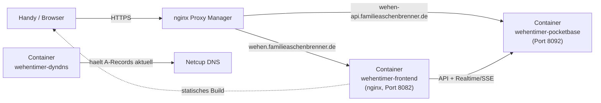

# INITIAL_DEPLOYMENT.md — Erst-Deployment auf dem ugreen-NAS

> Diese Anleitung ist für die **einmalige Ersteinrichtung**. Sie setzt voraus,
> dass auf dem ugreen-NAS bereits **Docker** (Container Manager) und ein
> laufender **nginx Proxy Manager** (NPM) vorhanden sind, und dass du Zugriff
> auf die Netcup CCP (Customer Control Panel) von `familieaschenbrenner.de`
> hast. Zugriff ausschließlich per SFTP/File-Manager (kein SSH), NPM-Container
> wird bewusst nie angefasst. Für spätere Updates reicht danach ein
> einfacheres Vorgehen (siehe Abschnitt 11).

## 0. Kurzüberblick



Drei Container, zwei Subdomains, kein Login. `familieaschenbrenner.de` zeigt
bisher noch gar nicht auf dieses NAS — die dynamische öffentliche IP wird
über einen dritten Container (`wehentimer-dyndns`, exakt derselbe Client wie
bei `otherApp`s `dyndns`-Service) automatisch bei Netcup (CloudDNS) aktuell
gehalten. Der NPM-Container wird bewusst **nicht angefasst** (kein
gemeinsames Docker-Netzwerk, kein Recreate) — stattdessen veröffentlichen
Frontend und PocketBase feste, unübliche Host-Ports (`8082`/`8092`), und NPM
zeigt per "Forward Hostname/IP" auf die **NAS-LAN-IP** + die jeweiligen
Ports. `wehentimer-dyndns` braucht keinen Port (kein Web-UI, reiner
Cron-Client).

Das **Frontend wird lokal gebaut** (`prepare-deploy.ps1`, wie bei `otherApp`)
und nur der fertige `dist/`-Ordner aufs NAS hochgeladen — kein npm-Build mehr
im Docker-Build auf dem NAS (vermeidet Datei-Rechte-Probleme, siehe
`otherApp`s Lessons Learned zu "403 Forbidden").

## 1. Netcup: API-Zugangsdaten besorgen

Falls beim `otherApp`-Projekt (`proviantplaner.de`) schon ein DynDNS-Container
eingerichtet wurde: die dortige Kundennummer ist account-weit gleich, ein
neuer CloudDNS-API-Key lässt sich trotzdem gut je Projekt trennen. Falls noch
nichts existiert:

1. In der [Netcup CCP](https://www.customercontrolpanel.de/) einloggen.
2. Menü **"Meine Daten"** (oder "Stammdaten") → Tab **"API"**.
3. Im Bereich **"API-Keys"** (oben, **nicht** "Legacy-API-Keys") einen Key
   generieren — das ist der reguläre CloudDNS-API-Key, den
   `wehentimer-dyndns` (`stecklars/dynamic-dns-netcup-api`) für
   CloudDNS-verwaltete Domains braucht. Kein separates API-Passwort nötig.
4. Die **Kundennummer** steht oben auf jeder CCP-Seite neben deinem Namen.
5. Zur Kontrolle: In der CCP unter Domains bei `familieaschenbrenner.de` auf
   die Lupe klicken — ein Tab **"CloudDNS"** (statt "DNS") bestätigt, dass
   dieser Weg (und nicht die Legacy-API) der richtige ist.

Notiere dir Customer-Nummer und CloudDNS-API-Key — sie werden gleich in eine
`.env` **nur auf dem NAS** eingetragen, niemals ins Repo oder in einen Chat.

## 2. Netcup: DNS-Einträge anlegen

`stecklars/dynamic-dns-netcup-api` legt fehlende A-Records automatisch an,
sobald der Container das erste Mal läuft (Schritt 5/6) — in der CCP muss
vorher **nichts** manuell angelegt werden, und die TTL wird von der
CloudDNS-DynDNS-API automatisch auf 300s gesetzt. Optional lässt sich vorab
zur Kontrolle prüfen, dass unter Domains → `familieaschenbrenner.de` →
CloudDNS noch keine `wehen`/`wehen-api`-Records existieren.

## 3. Lokal bauen

Im Projektordner in PowerShell:

```powershell
.\prepare-deploy.ps1
```

Das Skript baut die App (`npm run build`, liest dabei automatisch
`.env.production` mit `VITE_POCKETBASE_URL=https://wehen-api.familieaschenbrenner.de`)
und legt einen `deploy/`-Ordner an:

```
deploy/
├── dist/
├── Dockerfile
├── docker-compose.yml
├── nginx.conf
└── pocketbase/
    ├── Dockerfile
    └── pb_migrations/
```

## 4. Deploy-Ordner + `.env` aufs NAS bringen

Inhalt von `deploy/` per SFTP/File-Manager auf das NAS kopieren, z. B. nach:

```
/volume1/docker/wehentimer/   (Pfad je nach ugreen-NAS-Oberfläche anpassen)
```

Im selben Ordner auf dem NAS eine **neue** Datei `.env` anlegen (nur dort,
nie ins Repo/`deploy/`-Ordner):

```dotenv
NETCUP_CUSTOMERNR=<aus Schritt 1>
NETCUP_CLOUDDNS_APIKEY=<aus Schritt 1>
```

`VITE_POCKETBASE_URL` wird **nicht** mehr gebraucht — die URL steckt bereits
fest im lokal gebauten `dist/`-Bundle (Schritt 3).

## 5. Container Manager: Compose-Projekt anlegen und starten

Im Container Manager ein neues Projekt aus dem hochgeladenen Ordner erstellen
(Projekt → Erstellen → Ordner `/volume1/docker/wehentimer/` auswählen,
`docker-compose.yml` wird erkannt) und bauen/starten (Build + Up).

Danach die Logs von `wehentimer-pocketbase` prüfen — die zwei Migrationen
(`1790000000_create_contractions.js`, `1790000010_create_settings.js`)
sollten beim ersten Start automatisch angewendet werden ("Applied ...").

## 6. dyndns-Container prüfen

Logs von `wehentimer-dyndns` ansehen (`docker compose logs wehentimer-dyndns`)
— dort sollte ein erfolgreicher Lauf für `familieaschenbrenner.de: wehen,
wehen-api` stehen (Records werden beim ersten Lauf automatisch angelegt,
falls sie noch nicht existieren). Mit
`nslookup wehen.familieaschenbrenner.de 8.8.8.8` prüfen, ob die Auflösung
bereits nach außen die richtige IP liefert (kann etwas dauern, TTL 300s).

## 7. nginx Proxy Manager: zwei Proxy Hosts anlegen

**Host 1 — Frontend**
- Domain Names: `wehen.familieaschenbrenner.de`
- Scheme: `http`, Forward Hostname/Port: **NAS-LAN-IP** / `8082`
- SSL: Let's Encrypt-Zertifikat anfordern, **Force SSL** und **HTTP/2** an
- HSTS: an, **`includeSubDomains` AUS lassen** (siehe Lessons Learned in
  PROJECT_BRIEF.md)

**Host 2 — PocketBase-API**
- Domain Names: `wehen-api.familieaschenbrenner.de`
- Scheme: `http`, Forward Hostname/Port: **NAS-LAN-IP** / `8092`
- SSL: ebenso Let's Encrypt + Force SSL
- **Advanced-Tab: `/_/` (Adminpanel) auf das Heimnetz beschränken**, damit es
  nicht offen im Internet steht, z. B.:
  ```nginx
  location /_/ {
      allow 192.168.0.0/16;   # eigenes LAN anpassen
      deny all;
      proxy_pass http://<NAS-LAN-IP>:8092;
      proxy_set_header Host $host;
      proxy_set_header X-Real-IP $remote_addr;
      proxy_set_header X-Forwarded-For $proxy_add_x_forwarded_for;
      proxy_set_header X-Forwarded-Proto $scheme;
  }
  ```

Danach **nachmessen statt der UI-Anzeige zu vertrauen**:

```bash
curl -s -o /dev/null -w "%{http_code} %{redirect_url}\n" http://wehen.familieaschenbrenner.de/
curl -s -o /dev/null -w "%{http_code} %{redirect_url}\n" http://wehen-api.familieaschenbrenner.de/
```

Erwartet wird jeweils `301` auf `https://…`.

## 8. Erststart-Absicherung im PocketBase-Adminpanel

Über `https://wehen-api.familieaschenbrenner.de/_/` (nur aus dem Heimnetz
erreichbar) einmalig:

1. Superuser-Konto anlegen (Ersteinrichtungs-Assistent beim ersten Aufruf).
2. **Settings → Rate limiting**: aktivieren, z. B. `*:create`/`*:update` auf
   30 Anfragen / 60 Sekunden begrenzen — bremst Missbrauch der bewusst
   offenen Schreibrechte (kein Login, siehe PROJECT_BRIEF.md Abschnitt 6).
3. Prüfen, dass die Collections `contractions` und `settings` mit den
   erwarteten Feldern angelegt wurden (Collections-Übersicht) und dass
   `settings` genau einen Datensatz mit den Werten `5 / 1 / 60` enthält.

## 9. Funktionstest

- `https://wehen.familieaschenbrenner.de` im Browser öffnen, Tab "Erfassung":
  Start/Stop-Timer einmal testen, danach über den Plus-Button einen Eintrag
  manuell nachtragen.
- Tab "Auswertung": KPI-Kachel und Diagramme sollten die Testeinträge zeigen.
- **Echtzeit-Sync testen:** Seite auf einem zweiten Gerät (oder privatem
  Fenster) öffnen — neue Einträge müssen dort ohne Neuladen erscheinen.
- **PWA-Installation testen:** Auf dem Handy die Seite öffnen → Browser-Menü
  → "Zum Startbildschirm hinzufügen" (Android/Chrome) bzw. "Teilen → Zum
  Home-Bildschirm" (iOS/Safari). Icon sollte das Icon.png-Logo zeigen.
- Bei Auffälligkeiten zuerst `docker compose logs wehentimer-pocketbase` bzw.
  `wehentimer-frontend`/`wehentimer-dyndns` prüfen.

## 10. Updates nach der Ersteinrichtung

Für spätere Codeänderungen reicht:

```powershell
.\prepare-deploy.ps1
```

Danach den Inhalt von `deploy/` wieder aufs NAS hochladen (überschreibt die
gleichnamigen Dateien/Ordner — `.env` und `pb_data` auf dem NAS **nicht**
anfassen) und im Container Manager das Projekt **neu bauen** (nicht nur neu
starten, sonst gelangen die neuen `dist/`-Dateien nicht ins Frontend-Image)
und alle drei Container neu starten. Migrationen in `pocketbase/pb_migrations/`
werden dabei automatisch angewendet.

## 11. Abschalten nach Ende des Nutzungszeitraums

Die App ist bewusst nur für wenige Tage gedacht. Zum vollständigen Abbau:

```bash
docker compose down -v   # -v löscht auch das PocketBase-Datenvolume (pb_data)!
```

Danach zusätzlich:
- Die beiden Proxy Hosts im nginx Proxy Manager löschen oder deaktivieren.
- Die beiden DNS-Einträge (`wehen`, `wehen-api`) in der Netcup CCP entfernen,
  falls sie nicht anderweitig gebraucht werden (der `dyndns`-Container ist
  mit `down -v` ohnehin gestoppt und aktualisiert sie nicht mehr).
- Optional den Projektordner vom NAS löschen.

**Vor `down -v`** kurz überlegen, ob die erfassten Wehen-Daten noch gebraucht
werden (z. B. als Rückblick) — notfalls vorher `pb_data` sichern
(`docker cp wehentimer-pocketbase:/pb/pb_data ./backup-pb_data`).

